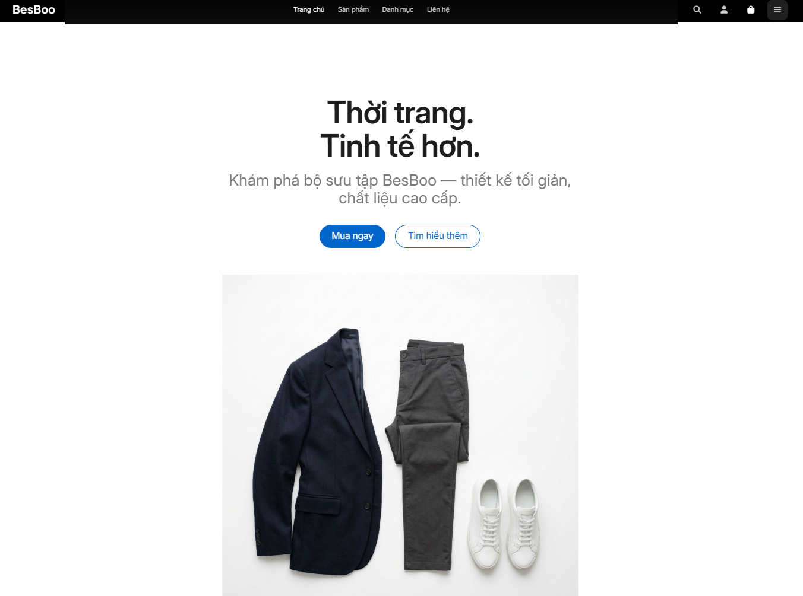
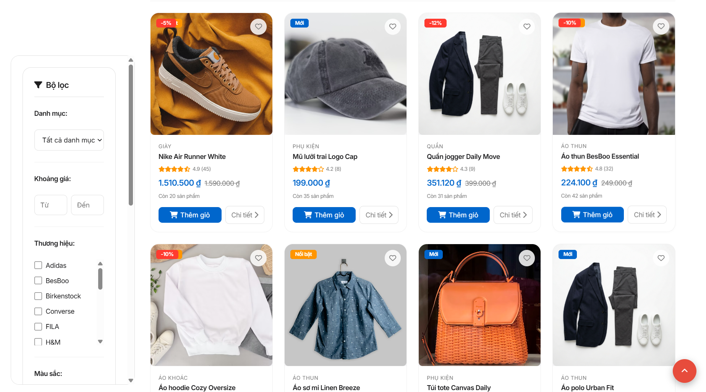
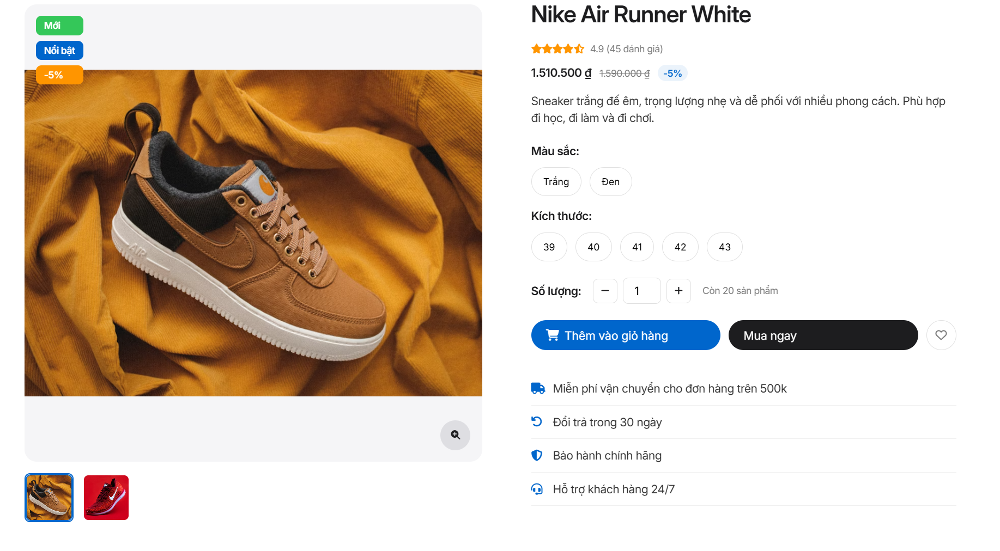

# BesBoo E-Commerce Platform

> **BesBoo** là một nền tảng web thương mại điện tử hiện đại, mang phong cách thiết kế tối giản (minimalism) lấy cảm hứng từ ngôn ngữ thiết kế của Apple. Dự án được xây dựng với mục tiêu mang lại trải nghiệm mua sắm mượt mà, trực quan, tập trung tối đa vào nguyên lý UI/UX và hành trình người dùng.

---

## 🎨 Triết lý Thiết kế UI/UX

- **Minimalist & Clean:** Sử dụng không gian trắng (white space) hợp lý, bảng màu trung tính tinh tế và typography hiện đại để hướng sự chú ý của người dùng hoàn toàn vào sản phẩm.
- **Micro-Interactions (Vi tương tác):** Hiệu ứng hover mượt mà, thông báo dạng Toast, và các chuyển động (transitions) tinh tế cung cấp phản hồi tức thì cho người dùng mà không gây rối mắt.
- **Responsive Architecture:** Giao diện tương thích hoàn hảo và tự động tối ưu hiển thị trên mọi thiết bị (Mobile, Tablet, Desktop).
- **Intuitive Navigation:** Trải nghiệm tìm kiếm được tối ưu với bộ lọc (Filter) động, sắp xếp (Sorting) trực quan và thanh điều hướng Breadcrumb giúp giảm tải nhận thức (cognitive load).

---

## 🚀 Tính năng Nổi bật

Dự án hiện đã hoàn thiện một loạt các tính năng thiết yếu của một trang thương mại điện tử chuyên nghiệp:

### 🛍 Trải nghiệm Mua sắm
- **Khám phá Sản phẩm (Product Listing - PLP):** Lọc sản phẩm nâng cao theo danh mục, giá cả, màu sắc, kích thước và phân trang.
- **Chi tiết Sản phẩm (Product Detail - PDP):** Hiển thị đầy đủ thông số, bộ sưu tập ảnh (thumbnail gallery), và tính năng chọn phân loại (size, màu) mượt mà.
- **Giỏ hàng Thông minh (Cart Management):** Thêm, xóa, sửa số lượng sản phẩm linh hoạt. Đồng bộ mượt mà giữa trạng thái khách (guest) và người dùng đã đăng nhập.

### 👤 Trải nghiệm Người dùng
- **Xác thực và Bảo mật (Authentication):** Đăng nhập, Đăng ký và Đăng xuất an toàn dựa trên JWT/Token. 
- **Quản lý Hồ sơ Cá nhân (Profile):** Cập nhật thông tin cá nhân, thay đổi mật khẩu an toàn.
- **Quản lý Đơn hàng (Order History):** Theo dõi danh sách đơn hàng đã mua và trạng thái xử lý chi tiết ngay trên giao diện trực quan.

### 🔌 Kiến trúc Dữ liệu & Fallback
- **Kiến trúc Mock API Thông minh:** Tích hợp hệ thống Fallback nội bộ (`product-data.js` & `api.js`). Hệ thống tự động chuyển đổi giữa Real API và Local Mock API ngay khi mất kết nối mạng hoặc khi Backend không khả dụng (phù hợp khi deploy tĩnh trên Vercel hoặc Github Pages).

---

## 📸 Giao diện Nổi bật (UI/UX Showcase)

*Dưới đây là một số hình ảnh thực tế của dự án thể hiện luồng trải nghiệm người dùng.*

### 1. Trang chủ (Homepage)

### 2. Danh sách Sản phẩm (Product Listing - PLP)

### 3. Chi tiết Sản phẩm (Product Detail - PDP)

---

## 🛠️ Công nghệ Sử dụng

- **Frontend:** Vanilla HTML5, CSS3 (Xây dựng Design System & Tokens riêng biệt), JavaScript (ES6+).
- **Kiến trúc mã nguồn:** Thiết kế theo hướng Module và Component (ví dụ: `components.js`, `api.js`) để dễ dàng tái sử dụng và quản lý.
- **Quản lý dữ liệu (State):** Xử lý luồng dữ liệu Client-side và LocalStorage thông minh, đồng bộ giữa các tabs.
- **Icons & Assets:** FontAwesome 6, Unsplash Images.
- **Deploy:** Hỗ trợ tối ưu để triển khai tĩnh trên các nền tảng như **Vercel** hoặc **GitHub Pages**.

---

## ✍️ Tác giả

Được thiết kế và phát triển bởi **[BesBoo]**
